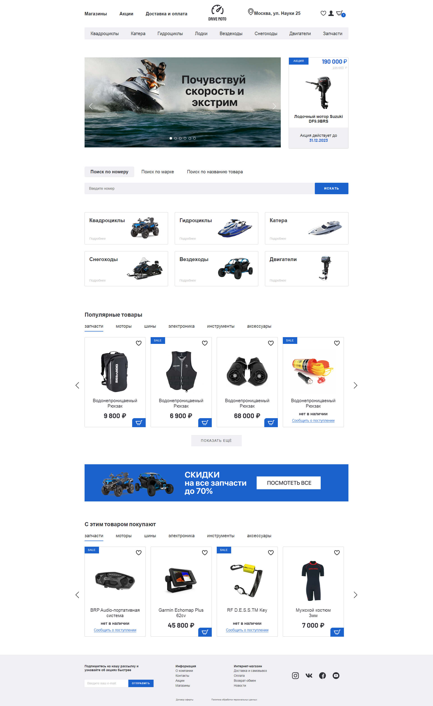

# Интернет-магазин гидроциклов «Drive Moto»

## Описание проекта

Drive Moto — это интернет-магазин гидроциклов, который включает в себя три ключевые страницы: главную страницу, страницу каталога товаров и страницу товара.

## Функционал:
- User eXperience (UX);
- Адаптивный интерфейс для планшетов и мобильных устройств.

## Стек технологий:

- HTML5;
- CSS3:
  - Flexbox;
  - Positioning;
  - Adaptive UI;
  - Media Queries;
- Методология БЭМ;
- Вёрстка по макету в Figma;
- JavaScript:
  - Работа с DOM;
  - Использование современных возможностей языка.

## Языки:

- JavaScript

## Плагины:

- [slick](https://kenwheeler.github.io/slick/) — плагин для создания адаптивного слайдера любой сложности;
- [jQuery Form Styler](https://dimox.name/jquery-form-styler/) — плагин позволяющий стилизовать селекты, чекбоксы и радиокнопки;
- [Ion.RangeSlider](http://ionden.com/a/plugins/ion.rangeslider/index.html) — плагин для создания отзывчивого ползунка с множеством опций;
- [Rate Yo!](https://rateyo.fundoocode.ninja/) — плагин для добавления интерактивного рейтинга в виде звёзд.

## Макет в Figma:

- [Макет Drive Moto](https://www.figma.com/file/k17ZcsTKSxJLE3wZT1Zoik/Drive-moto)

## Скриншоты:

<b>Развернуть</b>

## Карта сайта:

- Главная: https://ia-stepanov.github.io/drive-moto-shop
- Каталог: https://ia-stepanov.github.io/drive-moto-shop/catalog
- Страница товара: https://ia-stepanov.github.io/drive-moto-shop/product-page

